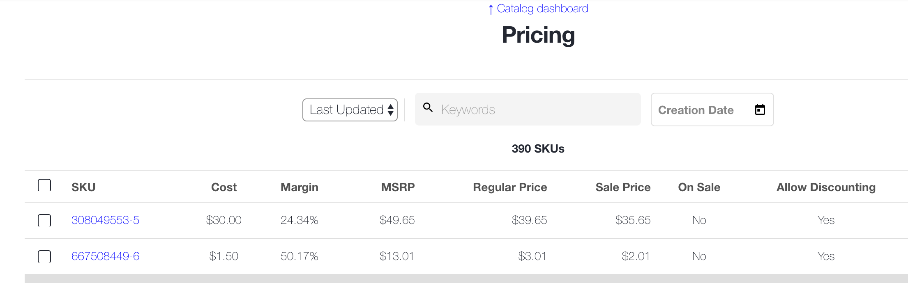
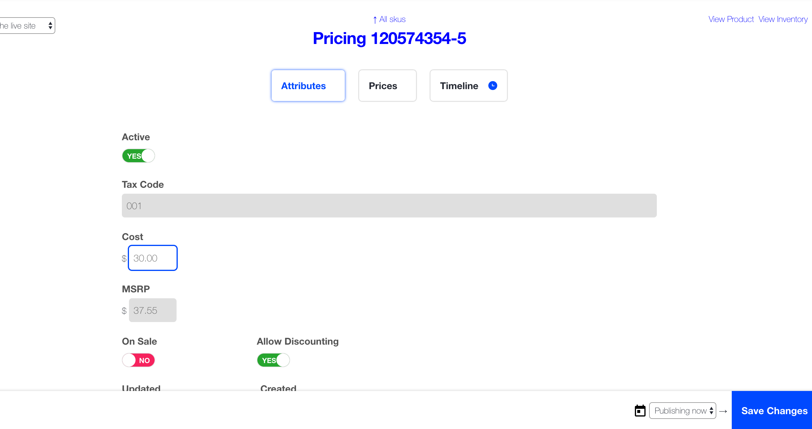

# Workarea Margin

## Overview

- Allows adding cost to pricing skus
- Pricing admin view will show margin based on regular price or sale price depending on the sale flag

## Getting Started

Add the gem to your application's Gemfile:

```ruby
# ...
gem 'workarea-margin', '~> 1.0', '>= 1.0.1'
# ...
```

Update your application's bundle.

```bash
cd path/to/application
bundle
```

## Screenshots





## Append Points

Append partials need to be added to your platform to work:

These append points can be added between any column on the pricing table, they will be in order of cost then margin. The default location is before MSRP, but it could go after and make sense as well.

```haml
This should be updated in the Workarea codebase soon.

admin/app/views/workarea/admin/pricing_skus/index.html.haml

- if @search.results.any?
  %table.index-table
    %thead
      %tr
        %th.index-table__control-cell
          .checkbox
            = check_box_tag 'select_all', nil, false, id: 'select_all', class: 'checkbox__input', data: { bulk_action_select_all: '' }
            = label_tag 'select_all', t('workarea.admin.bulk_actions.select_all'), class: 'checkbox__label'
        %th= t('workarea.admin.fields.sku')
****    = append_partials('admin.pricing_skus_additional_field_labels')    **** LABELS
        %th.align-right= t('workarea.admin.fields.msrp')
        %th.align-right= t('workarea.admin.fields.regular')
        %th.align-right= t('workarea.admin.fields.sale_price')
        %th.align-center= t('workarea.admin.fields.on_sale')
        %th.align-center= t('workarea.admin.fields.allow_discounting')
        %th= t('workarea.admin.fields.updated_at')
    %tbody
      - @search.results.each do |result|
        %tr.index-table__row{ class: ('index-table__row--inactive' unless result.active) }
          %td.index-table__control-cell
            .checkbox
              = check_box_tag 'global_id', result.to_gid_param, false, class: 'checkbox__input', id: dom_id(result), data: { bulk_action_item: '' }
              = label_tag dom_id(result), '', class: 'checkbox__label', title: t('workarea.admin.bulk_actions.add_summary_button')
          %td
            = link_to result.id, pricing_sku_path(result)
            = upcoming_changesets_icon_for(result)
****      = append_partials('admin.pricing_skus_additional_fields', result: result)    **** FIELDS
          %td.align-right= number_to_currency result.msrp
          %td.align-right= number_to_currency result.regular_price
          %td.align-right= number_to_currency result.sale_price
          %td.align-center= t("workarea.admin.#{result.on_sale?}")
          %td.align-center= t("workarea.admin.#{result.discountable?}")
          %td= local_time_ago(result.updated_at)
```

## Workarea Commerce Documentation

See [https://developer.workarea.com](https://developer.workarea.com) for Workarea Commerce documentation.

## License

Workarea Reviews is released under the [Business Software License](LICENSE)
